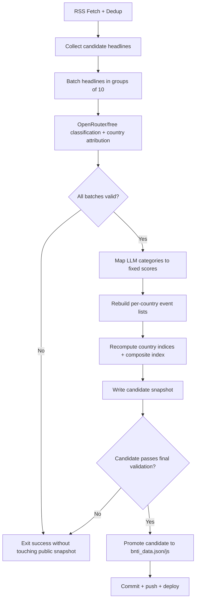

# BNTI Free LLM Automation Design

## Goal

Automate the BNTI pipeline so that every 2-hour run uses `openrouter/free` to make the final country attribution and threat classification decisions, publishes only fully validated snapshots, exits successfully on failures, and keeps the public site unchanged when a run is bad.

## Decisions

### 1. The LLM is the source of truth for final labeling

The final published `country` and `category` for each headline will come from the LLM, not from RSS feed origin and not from the local zero-shot classifier.

The local XLM-RoBERTa model should no longer determine the production score. It can be removed from the scoring path entirely, or retained only as a future diagnostic tool. The published result should be based on the LLM output only.

### 2. Canonical LLM taxonomy

The prompt will force the LLM to choose from one exact category enum. The pipeline will map those labels to fixed scores after validation.

Proposed canonical category table:

| Category | Score |
|---|---:|
| `military_conflict` | `+8.0` |
| `terrorism` | `+7.0` |
| `border_security` | `+5.0` |
| `political_instability` | `+4.0` |
| `humanitarian_crisis` | `+3.0` |
| `diplomatic_tensions` | `+2.5` |
| `trade_agreement` | `-2.0` |
| `neutral` | `0.0` |

This gives the LLM real classification authority while keeping the scoring deterministic and auditable.

### 3. Small-batch OpenRouter orchestration

Do not send all headlines in one request. Use fixed-size batches, default `10` headlines per batch.

Each batch request will:

- use `model = openrouter/free`
- ask for exact JSON only
- ask for both `countries` and `category`
- use direct-subject attribution rules
- reject proximity-based inferences such as Lebanon-only headlines being assigned to Iran or Syria

### 4. Automatic key failover

Use two GitHub Actions secrets:

- `OPENROUTER_API_KEY`
- `OPENROUTER_API_KEY_BACKUP`

For each batch:

1. Try primary key
2. If rejected, rate-limited beyond retry budget, or provider routing causes an unrecoverable response problem, retry with backup key
3. If both fail, mark the run invalid

### 5. Soft-success / no-publish gate

This is the core production rule.

If any batch fails validation or cannot be completed:

- do not overwrite `bnti_data.json`
- do not overwrite `bnti_data.js`
- do not append to history
- do not commit or push
- exit the workflow successfully

Result: the public dashboard continues showing the last known-good snapshot.

### 6. No partial publish

Mixed runs are not acceptable. If 10 batches are expected and only 9 succeed, the run is not publishable.

The pipeline should build a candidate snapshot in memory or in temporary files, validate it end to end, and only then promote it to the public files.

### 7. No extra internal artifact

Per your instruction, the workflow should not create a separate public or internal audit artifact. The system should either:

- publish a complete new snapshot, or
- leave the old public snapshot untouched

### 8. Website behavior

The website should not try to explain failed runs. If the pipeline cannot produce a valid snapshot, the site should simply continue serving the last good published files.

No stale banner is required.

## Target Pipeline

## Validation Rules

Every batch must satisfy all of the following:

- response is valid JSON
- every requested id is present exactly once
- every country is one of the 7 border countries or `IRRELEVANT`
- every category is one of the canonical LLM categories
- no empty `countries`
- no unparseable content

The full candidate snapshot must satisfy:

- all expected batches succeeded
- all expected headlines were processed
- every event written to a country bucket has a valid category and score
- public JSON/JS output can be serialized without error

## Why this is the right compromise

This design matches your chosen constraints:

- `fast/free-only`: keeps `openrouter/free`
- `soft-success`: workflow should not fail
- `no publish on bad run`: last good snapshot remains live
- `automatic backup key`: failover is built in
- `LLM decides country and classification`: no feed-origin override and no keyword-country override

## Scope Exclusions

Not part of this change:

- adding a paid model
- adding a separate review queue
- adding manual moderation tools
- adding a public stale-state banner
- adding internal audit artifacts
